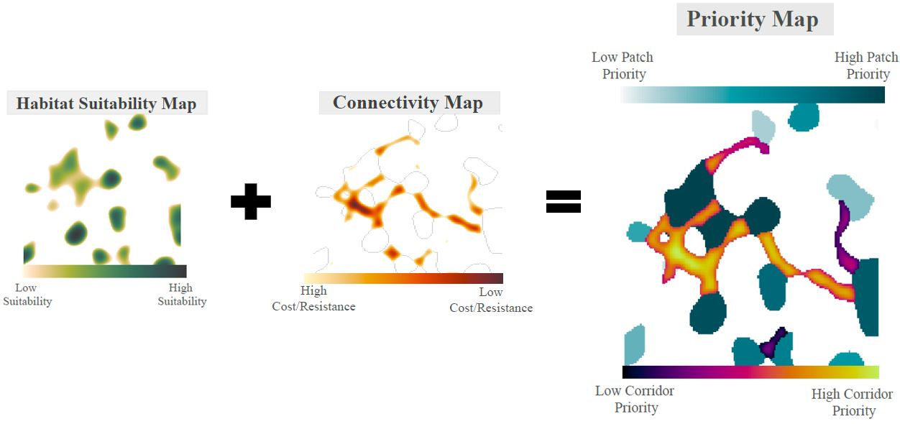

Landscape connectivity is a vital component of biodiversity conservation as it facilitates the movement of individuals and genes between habitat patches to help maintain populations and metapopulations and increase persistence of species faced with global change. As land-use change and habitat fragmentation are a growing threat to native ecosystems across the globe, preserving landscape connectivity is a pressing issue for conservation biologists. With the current rate of global change and lack of resources for conservation, prioritization of which habitats and corridors should be conserved to promote maximum landscape connectivity for species persistence is necessary to most efficiently enact effective management plans.

Species Distribution Models (SDMs) are used to map areas across a landscape that are suitable for species presence, and landscape resistance models identify functional connectivity by mapping paths that support movement and gene flow between habitat patches. Many studies have found that SDMs are not very useful in predicting the matrix permeability and subsequent functional connectivity among patches. On the other hand, landscape resistance models do not provide any information on the habitat quality and species abundance at each patch, while numerous studies have found that high suitability predicted by SDMs corresponds well with high abundance. Therefore, SDMs and landscape resistance models complement each other well in these respects and should be used synergistically for corridor planning. To facilitate the use of both models, my goal is to develop an open-source toolset in the form of an R package that integrates SDM and landscape resistance model outputs to calculate corridor importance in terms of the level of movement it supports combined with the size and quality of habitats it connects (Figure 1). 

 *Figure 1. Conceptual design where A) represents a landscape resistance map in which thicker lines represent higher levels of movement, B) represents an SDM output showing patches of suitable habitat, and C) is the result of combining A) and B), where darker colors represent more importance to landscape connectivity in terms of the amount of movement the corridor supports and the quality of habitat it connects.*

While numerous studies have used both methods in a conservation context, currently there is no easy way to integrate the two methods, particularly for corridor prioritization. While there are several other software programs that can perform habitat connectivity analyses, some of these programs are not freely available and there is no tool that performs all these calculations in a single platform. The advantage of collating all these steps into a single R package is that the software is free, the entire process from pre-processing of input files to final map presentation is easily reproducible, and the process can be automated over numerous species, places, or time frames, which is not offered by the other software programs. The R programming language is one of the fastest growing coding languages, particularly for ecologists. As a publicly available and easy to execute package, this new toolset will expand the applicability of SDMs and landscape resistance models in addressing conservation issues and improve habitat patch and corridor prioritization, which is a vital step to effectively preserving biodiversity.

 <h2>Stay tuned, this is still a work in progress!<h2> 

