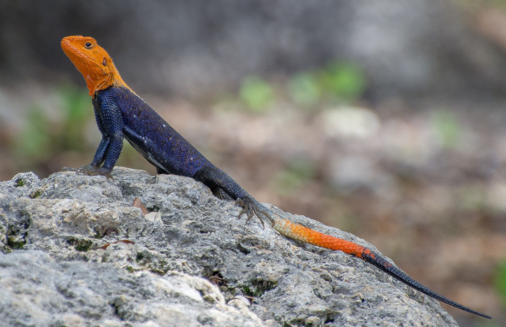
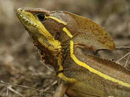
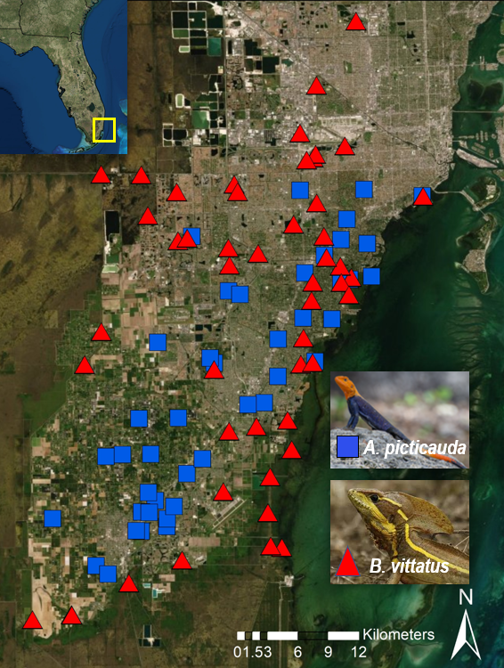

*Agama picticauda*                 |  *Basiliscus vittatus* 
:-----------------------------------:|:-----------------------------------:
  |  

South Florida is home to the world's largest community of introduced lizard species, with established populations of 43 different species. This community is a great example of the novel ecosystems concept, serving as a test case for how these novel systems operate, particularly how species disperse throughout a new habitat. As invasions become more common as a result of globalization, research on non-native populations is essential to inform managers on the best practices to prevent or reduce negative impacts on native ecosystems. To understand mechanisms of dispersal of these non-native lizard species, I am conducting a landscape genomics study, using next-gen sequencing to detect the relationship between environmental factors and spatial genetic structure, such as the factors that influence dispersal and persistence of the species.

For my study I am focusing on two large predatory lizards that, due to their generalist diets and large adult body size, likely impact native ecosystems but are poorly studied in their non-native range. These species are *Agama picticauda*, a rock specialist from sub-Saharan Africa, and *Basiliscus vittatus*, a riparian specialist from Central and South America. These species were both introduced in Miami in the 1970s and now occur all throughout Miami-Dade County. Utilizing an individual-based sampling approach, I have collected about 50 individuals of each species:
 

