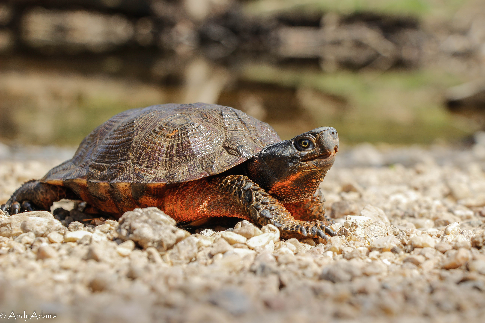
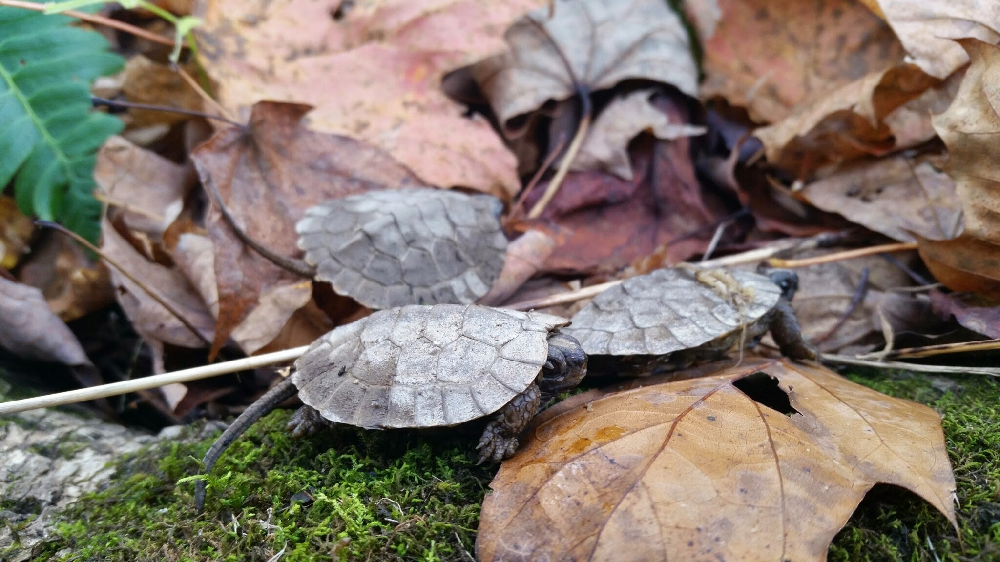
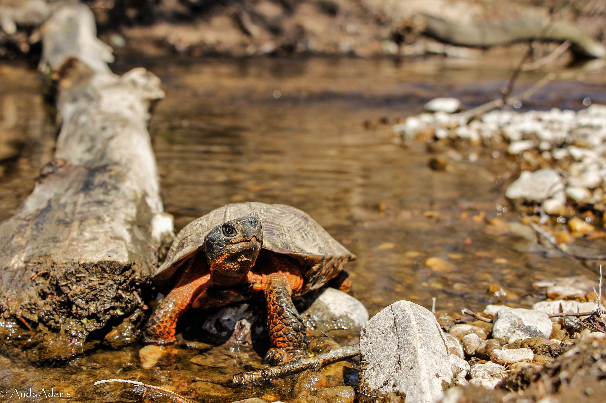

```{r setup, include=FALSE}

library(tidyverse)
library(raster)
library(leaflet)
library(leafsync)
library(viridis)
```

<div class = "row">
  
<div class = "col-md-4">
<br><br>
</div>
  
<div class = "col-md-4">
<br><br>
</div>
  
<div class = "col-md-4">
<br><br>
</div>
</div>


## Summary:
The use of ecological niche models to predict how future climate change may impact habitat suitability is a critical component of imperiled species management. These models allow for the identification of areas with high future suitability that will support the persistence of the species. We developed an ecological niche model and performed protected areas analysis to assess the current and future distribution of suitable habitat for the globally endangered wood turtle (*Glyptemys insculpta*) across the northeastern U.S. portion of its range. Our model predicts that by 2070 the suitable habitat for this species will decrease by 52%, and the total area of optimal habitat will decrease by 86%. Furthermore, currently only 5% of suitable habitat and 8% of optimal habitat is protected, with the total area of protected suitable and optimal habitat expected to decrease by 28% and 64%, respectively, by 2070. Our results suggest that long-term wood turtle conservation efforts should be directed towards protecting habitat in higher latitudes of their range, mainly in the states of Maine, Vermont, New Hampshire, and New York where the majority of climate refugia exist. Additionally, management action will be required to facilitate the northward transition of southern populations which are threatened with extinction due to rising temperatures. Along with having important conservation implications for the imperiled wood turtle, our study also serves as an example of how climate change assessments should be used to direct long-term conservation efforts of other imperiled species across the globe.

**Below is a preview of our findings (manuscript currently under review, stay tuned!)**

*** 

<br>

### Current (left) and Future (right) Habitat Suitability for the Wood Turtle
Dark colors indicate low suitability and bright colors indicate high suitability on a continuous scale of 0 - 1

```{r echo = FALSE, warning = FALSE, message = FALSE}
currSuit <- raster('data/analyses/current900.tif')

futureSuit <- raster('data/analyses/future900.tif')

x <- 0:1

pal <- leaflet::colorNumeric(palette = "inferno",
                             x,
                             na.color = "transparent")

curr <- leaflet() %>% addTiles() %>%
  addRasterImage(currSuit, colors = pal, maxBytes = 40 * 1024 * 1024) %>%
  addLegend(
    position = 'bottomright',
    pal = pal,
    values = x,
    bins = c(0, 0.2, 0.4, 0.6, 0.8, 1),
    title = 'Current Habitat Suitability'
  )

future <- leaflet() %>% addTiles() %>%
  addRasterImage(futureSuit, colors = pal, maxBytes = 40 * 1024 * 1024) %>%
  addLegend(
    position = 'bottomright',
    pal = pal,
    values = x,
    bins = c(0, 0.2, 0.4, 0.6, 0.8, 1),
    title = 'Future Habitat Suitability'
  )

leafsync::sync(curr, future, ncol = 2)
```
*Scroll on one of the maps to zoom in and out of both*

<br> 

### Change in suitability
Visualize how habitat suitablity changes from current to future climatic conditions. Throughout the entire range we find decreasing suitability values (red and orange colors), with hardly any areas increasing in suitability (noted by the lack of green colors)

```{r echo=FALSE, warning=FALSE, message=FALSE}
changeSuit <- raster('data/analyses/change900.tif')

x2 <- -1:1

pal2 <- leaflet::colorNumeric(palette = 'RdYlGn', x2, na.color = 'transparent')

leaflet() %>% addTiles() %>% 
  addRasterImage(changeSuit, colors = pal2, maxBytes = 40 * 1024 * 1024) %>%
  addLegend(
    position = 'bottomright',
    pal = pal2,
    values = x2,
    title = 'Change in Suitability'
  )
  

```
  
<br><br>
**This project is part of a collaboration with the Susquehannock Wildlife Society in Maryland where we are working on a 'trifecta' validation study, combining visual encounter surveys, eDNA sampling, and the predicted presence probability from this project to evaluate the accuracy of these various sampling methods.**


