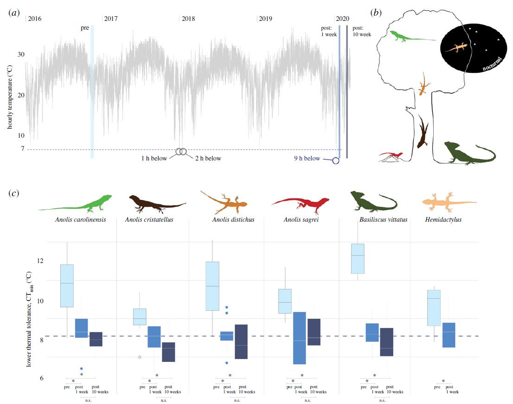

***  
## **Abstract**
Extreme climate events are predicted to increase in frequency and severity due to contemporary climate change. Recent studies have documented the evolutionary impacts of extreme events on single species, but no studies have yet investigated whether such events can drive community-wide patterns of trait shifts. On 22 January 2020, subtropical south Florida experienced an extreme cold episode during which air temperatures dropped below the lower thermal limit of resident lizard populations. In the week immediately after the cold event, we documented decreased lower thermal limits (CTmin) of six co-occurring lizard species that vary widely in ecology, body size and thermal physiology. Although cold tolerance of these species differed significantly before the cold snap, lizards sampled immediately after had converged on the same new, lower limit of thermal tolerance. Here, we demonstrate that extreme climate events can drive substantial and synchronous communitywide trait changes and provide evidence that tropical and subtropical ectotherms—often characterized as unable to withstand rapid changes in climatic conditions—can endure climatic conditions that exceed their physiological limits. Future studies investigating the mechanisms driving these trait shifts will prove valuable in understanding the ability of ectotherm communities to mitigate climate change.
 

    

**Figure 1**. Following an extreme cold event in south Florida, air temperatures *(a)* hit a decade-low of 4.4°C and six lizard species experienced short-term exposure to temperatures below their lower thermal tolerance limits. *(b)* Representation of the lizard community and their ecological niches drawn to scale with respect to relative size differences between species and not tree size. *(c)* Comparing lower thermal limits (CTmin) of species before (pre) and after (post) the extreme cold event, we observed shifts towards tolerance of lower temperatures. New, lower thermal limits remained 10 weeks after the extreme cold event. Horizontal blue dashed line at 7.2°C illustrates the immediate post-cold event community-wide mean CTmin: the most recent cold event experienced temperatures below this limit for a substantially longer period of time than previous events (circled in (a)). *p < 0.05; n.s., not significant.)*

