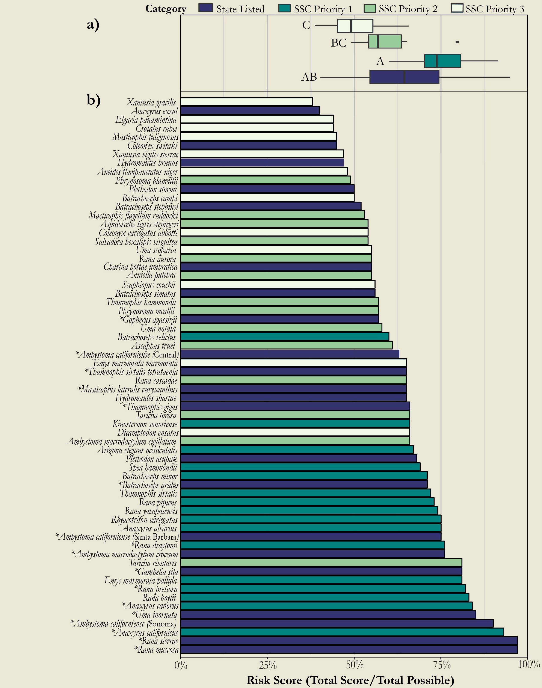
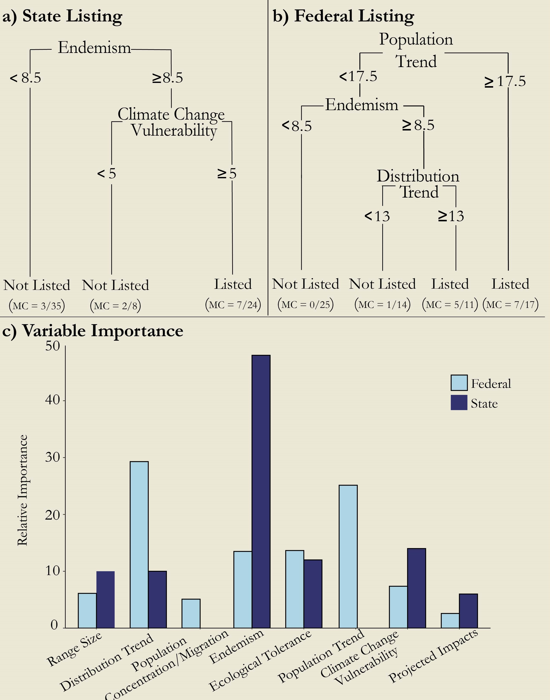

---
abstract:
authors:
- Caitlin C. Mothes
- Stephanie L. Clements
- Dishane K. Hewavithana
- Hunter J. Howell
- Aaron S. David
- Nicole D. Levanthal
- Christopher A. Searcy
date: "October 2019"
doi: "https://doi.org/10.1111/cobi.13421"
featured: true
image:
  caption: ''
  focal_point: ""
  preview_only: true
# links:
# - name: Custom Link
#  url: http://example.org
# projects:
# - internal-project
publication:
publication_short:
publication_types:
slug: standardized_methods

publishDate: "2019-10-01T00:00:00Z"
slides: 
summary: In *Conservation Biology*

title: Use of standardized methods to improve extinction risk classification
url_code: ''
url_dataset: ''
url_pdf: "files/Mothes_et_al-2020-Conservation_Biology.pdf"
url_poster: ''
url_project: 
url_slides: ""
url_source: ''
url_video: ''
---
***  
## **Abstract**

Standardized classification methods based on quantifiable risk metrics are critical for evaluating extinction threats because they increase objectivity, consistency, and transparency of listing decisions. Yet, in the United States, neither federal nor state agencies use standardized methods for listing species for legal protection, which could put listing decisions at odds with the magnitude of the risk. We used a recently developed set of quantitative risk metrics for California herpetofauna as a case study to highlight discrepancies in listing decisions made without standardized methods. We also combined such quantitative metrics with classification tree analysis to attempt to increase the transparency of previous listing decisions by identifying the criteria that had inherently been given the most weight. Federally listed herpetofauna in California scored significantly higher on the risk‐metric spectrum than those not federally listed, whereas state‐listed species did not score any higher than species that were not state listed. Based on classification trees, state endemism was the most important predictor of listing status at the state level and distribution trend (decline in a species’ range size) and population trend (decline in a species’ abundance at localized sites) were the most important predictors at the federal level. Our results emphasize the need for governing bodies to adopt standardized methods for assessing conservation risk that are based on quantitative criteria. Such methods allow decision makers to identify criteria inherently given the most weight in determining listing status, thus increasing the transparency of previous listing decisions, and produce an unbiased comparison of conservation threat across all species to promote consistency, efficiency, and effectiveness of the listing process.

*Figure 1. (a) Risk scores for California reptile and amphibian state-listed species and species of special concern priority 1, 2, and 3. (different letters denote significant differences between individual categories; overall stateand nonstate-listed species did not differ significantly [p = 0.34]) and (b) individual risk scores for all species assessed (∗, federally listed species, which scored significantly higher than nonfederally listed species [p < 0.001]).*
   

*Figure 2. Classification trees describing listed versus unlisted reptile and amphibian species at the (a) state (California) and (b) federal level (misclassification rates [MC] in parentheses for each terminal node; numbers on branches, species’ risk scores for risk metric indicated) and (c) relative importance of each risk metric inherent in the state and federal listing process.*

