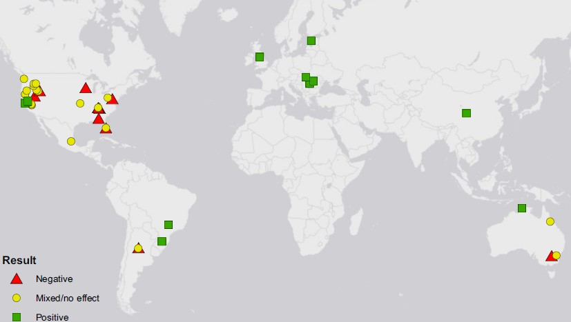
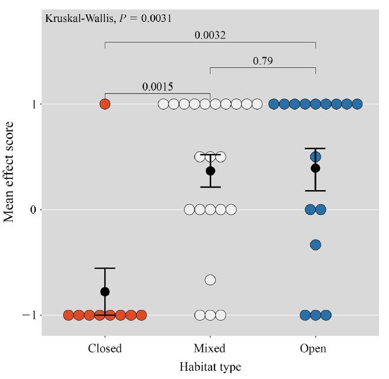

***  
## **Abstract**

Pastureland currently occupies 26% of Earth’s ice-free land surface. As the global
human population continues to increase and developing countries consume more proteinrich
diets, the amount of land devoted to livestock grazing will only continue to rise. To
mitigate the loss of global biodiversity as a consequence of the ever-expanding amount of land
converted from native habitat into pastureland for livestock grazing, an understanding of how
livestock impact wildlife is critical. While previous reviews have examined the impact of livestock
on a wide variety of taxa, there have been no reviews examining how global livestock
grazing affects amphibians. We conducted both an empirical study in south-central Florida
examining the impact of cattle on amphibian communities and a quantitative literature review
of similar studies on five continents. Our empirical study analyzed amphibian community
responses to cattle as both a binary (presence/absence) variable, and as a continuous variable
based on cow pie density. Across all analyses, we were unable to find any evidence that cattle
affected the amphibian community at our study site. The literature review returned 46 papers
that met our criteria for inclusion. Of these studies, 15 found positive effects of livestock on
amphibians, 21 found neutral/mixed effects, and 10 found negative effects. Our quantitative
analysis of these data indicates that amphibian species that historically occurred in closedcanopy
habitats are generally negatively affected by livestock presence. In contrast, opencanopy
amphibians are likely to experience positive effects from the presence of livestock, and
these positive effects are most likely to occur in locations with cooler climates and/or greater
precipitation seasonality. Collectively, our empirical work and literature review demonstrate
that under the correct conditions well-managed rangelands are able to support diverse assemblages
of amphibians. These rangeland ecosystems may play a critical role in protecting future
amphibian biodiversity by serving as an “off-reserve” system to supplement the biodiversity
conserved within traditional protected areas.

*FIG. 3. Locations of the reviewed studies examining the impacts of livestock grazing on amphibian abundance and richness. Of the 47 studies, 28 were conducted in the United States and 7 were conducted in Europe.*

*FIG. 4. Strip plot displaying amphibian species’ response to livestock. Amphibians that prefer closed-canopy habitat are more negatively affected by livestock than are amphibians that prefer open-canopy or mixed habitats types. Each white, red, or blue circle represents an amphibian species; black circles are means for each habitat type.*

