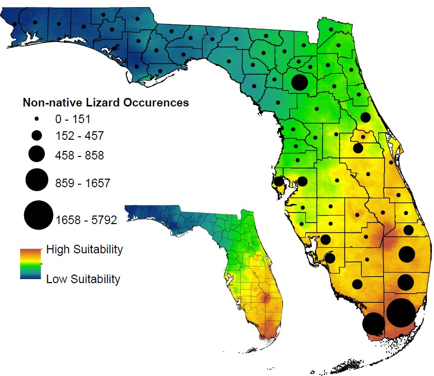

***  
## **Abstract**
**Aim** : Predicting environmentally suitable areas for non‐native species is an important step in managing biotic invasions, and ecological niche models are commonly used to accomplish this task. Depending on these models to enact appropriate management plans assumes their accuracy, but most niche model studies do not provide validation for their model outputs. South Florida hosts the world's most globally diverse non‐native lizard community, providing a unique opportunity to evaluate the predictive ability of niche models by comparing model predictions to observed patterns of distribution, abundance and physiology in established non‐native populations.  
**Location**: Florida, USA.  
**Taxon**: Lizards.  
**Methods** : Using Maxent, we developed niche models for all 29 non‐native lizard species with established populations in Miami‐Dade County, Florida, using native range data to predict habitat suitability in the invaded range. We then used independently collected field data on abundance, geographical spread and thermal tolerances of the non‐native populations to evaluate Maxent's ability to make predictions in both geographical and environmental space in the non‐native range. 
**Results** : Maxent performed well in predicting across geographical space where these non‐native lizards were most likely to occur, but within a given geographical extent was unable to predict which individual species would be the most abundant or widespread. Comparisons with physiological data also revealed an imperfect fit, but without any consistent biases.  
**Main conclusions** : We performed one of the most extensive field validations of Maxent's ability to predict where invasions are likely to occur, and our results support its continued use in this role. However, the program was unable to predict the relative abundance and geographical spread of established species, indicating limited utility for identifying which invasive species will be the greatest management concern. These results underscore the importance of other factors, such as time since introduction, dispersal ability and biotic interactions in determining the relative success of non‐native species post‐establishment. 

### **Data and Code found at: https://github.com/ccmothes/NicheModel**  

*Fig. 1: Predicted habitat suitability averaged across all 29 non‐native lizard species established in Miami‐Dade County. Black circles represent the number of recorded non‐native lizard localities within each Florida county. There was a strong positive correlation between the predicted and observed distributions of these nonnative lizards (p = 1e‐10)*

